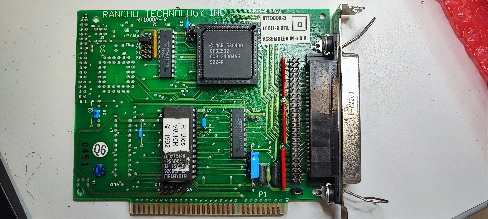

# Rancho-RT1000-SCSI-8-Bit
Recreation of a bootable ISA 8-Bit SCSI Card.

There can be one PAL on the Card (GAL20L8), this is for the floppy part only.
BIOS EPROM is a 27C128 Type, but only 8k are used.

[Schematic](schematic/Rancho%20RT1000/pdf/Rancho%20RT1000%20SCSI%20Controller.pdf)

For now there is no plan to manufacture the board.

| BIOS Ver.   |   8088/80C88        |    NEC V20       |   286      |  386SX     |
|-------------|---------------------|------------------|------------|------------|
| Rancho 8.10 | no boot, no ASPI    | no boot, no ASPI | boots+ASPI | boots+ASPI |
| Rancho 8.20 | no boot, no ASPI    | no boot, no ASPI | boots+ASPI | boots+ASPI |
| Corel 1.65  | no boot, no ASPI    | boots+Corel ASPI | boots+ASPI | boots+ASPI |

Comment: On an XT, even with V20 CPU, with Rancho BIOS, a Disk is found but hangs when trying to boot. RTASPI10.SYS says it needs a 286.

The Card semms to be the same as the Corel LS2000, so i tried the Corel BIOS and it works!

Unfortunately the Corel uses a different CHS Conversion, so the Rancho Images won't work.

The ASPI Driver from the Rancho (RTASPI10.SYS) works with the Corel BIOS and vice versa, BUT they need the correct CHS Values!

The ASPI Driver from the Corel (ASPILS_D.SYS) works with a V20 CPU, with a 8088 here is a Division Overflow (even with Math Copro 8087).

Heads and Sectors working with original RT1000 BIOS (v8.20):

Tested with MSDOS 5 and with a 386SX and does NOT work with an 8088 nor 80C88!:

(spc = Sectors/Cluster, spf = Sectors/FAT)

* C: 1023 / H:2  / S:32 32 MB (FAT16/4) spc=4,spf=0x40: works
* C: 1023 / H:4  / S:32 64 MB (FAT16/6) spc=4,spf=0x80: non-system disk
* C:  511 / H:8  / S:32 64 MB (FAT16/6) spc=4,spf=0x80: non-system disk
* C: 1015 / H:3  / S:43 65510 kB (FAT16/6) spc=4,spf=0x80: works
* C: 1023 / H:8  / S:32 128 MB (FAT16/6) spc=4,spf=0x100: non-system disk
* C: 1007 / H:5  / S:52 127.8 MB (FAT16/6) spc=4,spf=0x100: works
* C: 1021 / H:9  / S:57 261800 kB (FAT16/6) spc=8,spf=0x100: works
* C: 1023 / H:9  / S:57 262627 kB (FAT16/6) spc=16,spf=0x100: non-system disk
* C: 1010 / H:17  / S:60 515072 kB (FAT16/6) spc=16,spf=0xFC: works
* C: 1011 / H:31  / S:62 948 MB (FAT16/6) spc=32,spf=0xEE: works

Heads and Sectors working with Corel LS2000 BIOS (v1.65):

Tested with 386SX and does NOT work with an 8088!:

* C:  961 / H:17 / S:8 63.1 MB (FAT16/6) spc=4,spf=0x80: works
* C:  961 / H:17 / S:16 127.6 MB (FAT16/6) spc=4,spf=0xFF: works
* C: 1021 / H:32 / S:16 255.5 MB (FAT16/6) spc=16,spf=0x80: works
* C:  597 / H:64 / S:16 299 MB (FAT16/6) spc=16,spf=0x96: works
* C: 1003 / H:64 / S:16 502 MB (FAT16/6) spc=16,spf=0xFB: works
* C: 1019 / H:64 / S:16 509.9 MB (FAT16/6) spc=16,spf=0xFF: works
* C:  570 / H:64 / S:32 570.5 MB (FAT16/6) spc=32,spf=0x8F: works
* C:  571 / H:64 / S:32 572 MB (FAT16/6) spc=32,spf=0x8F: works
* C:  667 / H:64 / S:32 668 MB (FAT16/6) spc=32,spf=0xA7: works
* C:  762 / H:64 / S:32 763 MB (FAT16/6) spc=32,spf=0xBF: works
* C:  859 / H:64 / S:32 860 MB (FAT16/6) spc=32,spf=0xD7: works
* C:  903 / H:64 / S:32 904 MB (FAT16/6) spc=32,spf=0xE2: works
* C:  927 / H:64 / S:32 927.9 MB (FAT16/6) spc=32,spf=0xE8: works
* C: 1019 / H:64 / S:32 1020 MB (FAT16/6) spc=32,spf=0xFF: works
* C:  946 / H:64 / S:32 947 MB (FAT16/6) spc=32,spf=0xED: doesn't work
* C:  946 / H:64 / S:32 947 MB (FAT16/6) spc=32,spf=0xFB: doesn't work

It should be said that the Corel Drivers and BIOS is the way to go!